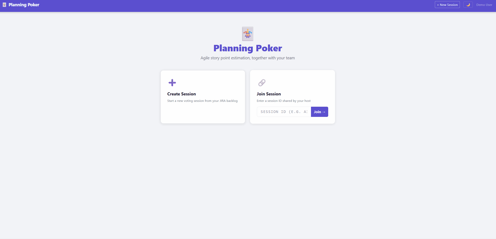

# Planning Poker

A real-time agile story point estimation tool built on ASP.NET Core Blazor Interactive Server (.NET 10). It integrates with Jira to pull backlog items directly into a voting session, and writes agreed story points back to Jira when the team reaches consensus.



---

## High-Level Overview

Planning Poker is used during sprint planning to estimate the effort of user stories. The host pulls stories directly from Jira, creates a session, and shares a link with the team. Everyone votes privately using a Fibonacci-ish deck (1, 2, 3, 5, 8, 13, 21, ?, ☕). Once the host reveals votes, the team discusses any outliers, agrees on a point value, and the app writes it back to the Jira ticket automatically.

### User Flow

```
Host                                Participants
────                                ────────────
Sign in (Entra ID)
Navigate to /create
  → Pick team/board from Jira
  → Select stories to vote on
  → Give session a name (optional)
  → Click "Start Session"
  
Navigate to /host/{id}
  Share link → /session/{id}        Open /session/{id}
                                    Sign in (Entra ID)
                                    Join session automatically
  
Select a story to vote on ──────►  See current story update live
Cast own vote (optional)            Cast vote (1–9 keyboard or click)
                                    
Click "Reveal Votes" ───────────►  All votes appear simultaneously
  
  See stats (avg, min, max)
  Set agreed points
  → Writes to Jira automatically
  
Click "Next Item" or
select another story ───────────►  Story updates, votes reset
  
Click "Cancel Session"             Participants see "Session not found"
```

### Key Capabilities

- **Live updates** — All participants see vote counts and story changes in real time without page refreshes, polling, or manual SignalR code. Blazor Server handles it automatically over its WebSocket circuit.
- **Jira integration** — Pulls unestimated stories from Jira (filtered to Estimation, Approved, and Ready for Sprint statuses with no current story points). Writes agreed points back when the host confirms.
- **Priority marking** — Any participant can flag items as priority; they sort to the top of the item list in all views simultaneously.
- **Emoji avatars** — Participants and the host pick an emoji that appears next to their name and under their vote card.
- **Keyboard voting** — Press 1–9 to vote by keyboard position in the deck.
- **Resizable columns** — Drag the handles between panels to redistribute screen space.
- **Active sessions on home page** — All in-progress sessions are visible on the home page. Hosts can rejoin or cancel; participants can jump straight in.
- **Microsoft Entra ID auth** — All routes require sign-in. Identity is used to distinguish the host from participants and to attribute votes.
- **Demo mode** — A single config flag disables auth and replaces the Jira integration with hardcoded fake issues. No credentials required; useful for screenshots, walkthroughs, and local development.

---

## Low-Level Technical Explanation

### Tech Stack

| Layer | Technology |
|---|---|
| Runtime | .NET 10 |
| Framework | ASP.NET Core Blazor Interactive Server |
| Auth | Microsoft Identity Web (Entra ID / Azure AD, OIDC) |
| Real-time transport | Blazor Server's SignalR circuit (automatic) |
| Session storage | JSON file (`sessions.json`) via `System.Text.Json`; `ConcurrentDictionary` as in-memory cache (singleton service) |
| Jira | REST API v3, HTTP Basic auth (`email:api_token`) |
| Secrets | `dotnet user-secrets` (dev) / environment/config (prod) |
| Styling | Custom CSS with Bootstrap 5 utilities |

### Project Structure

```
Server/
├── Program.cs                    # Service registration, middleware pipeline
├── Components/
│   ├── App.razor                 # Root component
│   ├── Routes.razor              # Router
│   ├── Layout/
│   │   ├── MainLayout.razor      # Nav bar, theme toggle, app shell
│   │   └── LoginDisplay.razor    # Sign in/out button
│   ├── Pages/
│   │   ├── Index.razor           # Home: active sessions + join/create
│   │   ├── CreateSession.razor   # Jira item picker + session name
│   │   ├── HostSession.razor     # Host view: control panel
│   │   └── Session.razor         # Participant view: voting interface
│   └── (shared components)
│       ├── JiraItemPicker.razor  # Team/search/checkbox item picker
│       ├── VotingDeck.razor      # The card deck UI
│       ├── VotingCard.razor      # Individual card
│       ├── VoteResults.razor     # Revealed votes, stats, agreed points
│       ├── CurrentItem.razor     # Story details display
│       ├── ParticipantList.razor # Live participant list
│       └── EmojiPicker.razor     # Avatar emoji grid
├── Models/
│   ├── PokerSession.cs           # All session state
│   ├── Participant.cs            # Per-participant state
│   ├── JiraItem.cs               # Jira story data
│   └── StoryPoints.cs            # Voting deck values constant
├── Services/
│   ├── ISessionService.cs        # Session management interface
│   ├── SessionService.cs         # JSON-backed session store (singleton)
│   ├── IJiraService.cs           # Jira operations interface
│   ├── JiraService.cs            # Jira REST API client
│   ├── DemoJiraService.cs        # Hardcoded fake issues (demo mode)
│   └── DemoAuthHandler.cs        # Always-authenticated handler (demo mode)
└── wwwroot/
    ├── css/app.css               # All application styles
    └── js/theme.js               # Theme toggle, keyboard voting, column resizer
```

### Authentication

`Program.cs` registers Microsoft Identity Web with the `AzureAd` config section:

```csharp
builder.Services.AddAuthentication(OpenIdConnectDefaults.AuthenticationScheme)
    .AddMicrosoftIdentityWebApp(builder.Configuration.GetSection("AzureAd"));
```

The app is configured for pure Authorization Code flow (not hybrid/implicit grant) via a `PostConfigure` that sets `ResponseType = OpenIdConnectResponseType.Code`. This requires a client secret but avoids enabling implicit grant on the Azure app registration.

Every page except the home page carries `@attribute [Authorize]`. The home page uses `<AuthorizeView>` to conditionally show the session list and action cards.

User identity is extracted from the `oid` claim (Azure object ID), which serves as the stable user identifier across sessions. Display names come from the `name` claim.

### Session Lifecycle

`SessionService` is registered as a **singleton**. It holds all active sessions in a `ConcurrentDictionary<string, PokerSession>` and persists the full dictionary to a single JSON file (`sessions.json`) after every mutation. Sessions survive server restarts.

```
CreateSession()      →  generates 8-char uppercase ID, stores PokerSession, saves to disk
JoinSession()        →  adds Participant to session.Participants (noop for host)
Vote()               →  sets p.HasVoted + p.Vote, or session.HostHasVoted + session.HostVote
RevealVotes()        →  sets session.VotesRevealed = true
ResetVoting()        →  clears all votes and VotesRevealed
SetCurrentItem()     →  replaces session.CurrentItem, resets all votes
SetAgreedPoints()    →  sets session.AgreedPoints
SetEmoji()           →  sets host or participant emoji
ToggleItemPriority() →  adds/removes itemKey from session.PriorityItems (HashSet)
SetHandRaised()      →  sets p.HandRaised on a participant (raise/lower hand)
Remove()             →  removes session from dictionary, saves to disk, fires SessionChanged
```

Every mutating operation calls `TryUpdate()`, which applies the change, persists to disk, and fires `SessionChanged`:

```csharp
public event Action<string>? SessionChanged;

public bool TryUpdate(string id, Action<PokerSession> update)
{
    if (!_sessions.TryGetValue(id.ToUpper(), out PokerSession? session)) return false;
    update(session);
    SaveAllToDisk();
    SessionChanged?.Invoke(id.ToUpper());
    return true;
}
```

#### Disk Persistence

Sessions are stored as a single JSON file at the path configured by `Sessions:StoragePath` (default: `App_Data/sessions/sessions.json`). Writes use an atomic rename pattern to prevent corruption:

```csharp
private void SaveAllToDisk()
{
    Dictionary<string, PokerSession> snapshot = new(_sessions); // snapshot outside lock
    string json = JsonSerializer.Serialize(snapshot, JsonOptions);
    string tmp = _filePath + ".tmp";
    lock (_writeLock)
    {
        File.WriteAllText(tmp, json);
        File.Move(tmp, _filePath, overwrite: true); // atomic on NTFS/ext4
    }
}
```

The snapshot is taken before the lock so JSON serialization (the slow part) doesn't block concurrent reads. If the process crashes mid-write, `sessions.json` stays intact and only the `.tmp` file is left behind. On startup, `LoadFromDisk()` reads the file and populates `_sessions` before the first request is served.

`App_Data/` is listed in `.gitignore` so session data is never committed to source control.

### Real-Time Updates (No Manual SignalR)

Blazor Interactive Server renders components on the server and keeps a persistent WebSocket connection (SignalR circuit) open to each browser tab. When the server calls `StateHasChanged()` on a component, Blazor diffs the component tree and pushes the DOM delta over that WebSocket.

Every page that displays session data subscribes to the singleton event:

```csharp
protected override async Task OnInitializedAsync()
{
    Sessions.SessionChanged += OnSessionChanged;
    ...
}

private void OnSessionChanged(string sessionId)
{
    if (!sessionId.Equals(SessionId, ...)) return;
    Session = Sessions.GetMaskedSession(SessionId);
    InvokeAsync(StateHasChanged);  // marshals onto the Blazor dispatcher
}
```

`InvokeAsync(StateHasChanged)` is required because the event fires from whichever thread triggered the mutation (e.g., a different user's circuit). Blazor's dispatcher ensures the re-render happens on the correct synchronization context for that circuit.

When `Remove()` fires `SessionChanged` for a deleted session, any participant still on `/session/{id}` gets `GetMaskedSession` returning `null`, sets `NotFound = true`, and re-renders to show "Session not found."

### Vote Masking

`GetMaskedSession()` returns a deep copy of the session with votes hidden until revealed:

```csharp
Vote = s.VotesRevealed ? p.Vote : (p.HasVoted ? "voted" : null)
```

This means participants and the host can never inspect the actual values before reveal, even if they poke at the Blazor state. The host view uses `SelectedValue="@null"` on the `VotingDeck` component so their selected card is not highlighted.

### Jira Integration

`JiraService` is registered as a typed `HttpClient` with the base URL and Basic auth header pre-configured from `appsettings.json` / user-secrets:

```
Jira:BaseUrl                 = https://yourcompany.atlassian.net/
Jira:ApiSecret               = email@example.com:ATATT3x...  (email:api_token)
Jira:StoryPointsField        = customfield_10031   (story points custom field ID)
Jira:StoryPointsFieldAlternate =                   (optional second field to write on update)
Jira:SprintField             = customfield_10020   (sprint custom field ID)
Jira:TeamField               = Team[Team]          (JQL field name for team filtering)
Jira:PriorityStatuses        = ["Ready for Sprint","Approved","Estimation"]
Jira:MaxResults              = 200
Jira:Teams:TeamName          = {guid}              (team GUID from Jira, one per team)
```

**Fetching items** — `GetItemsAsync` builds a JQL query against `POST /rest/api/3/search/jql`. Items are always filtered to unestimated stories (`"Story Points" IS EMPTY`). The sort order puts statuses listed in `Jira:PriorityStatuses` first (in configured order), then items with an assigned sprint before backlog items, then by ascending sprint ID.

**ADF to HTML** — Jira descriptions are returned as Atlassian Document Format (ADF) JSON. `JiraService.ExtractAdfHtml` recursively walks the node tree and emits safe HTML (`WebUtility.HtmlEncode` on all text nodes) with proper `<ul>/<ol>/<li>/<p>/<strong>/<em>` etc. The result is rendered via `@((MarkupString)Item.Description)`.

**Writing points** — `UpdateStoryPointsAsync` calls `PUT /rest/api/3/issue/{key}` with the story points value. The primary field is `Jira:StoryPointsField`; an optional `Jira:StoryPointsFieldAlternate` can be set if your instance syncs points to a second field.

### Demo Mode

Setting `Demo:Enabled` to `true` starts the app in a self-contained mode with no external dependencies:

| What changes | Detail |
|---|---|
| **Auth** | `DemoAuthHandler` replaces Azure AD. Every request is automatically authenticated as "Demo User" — no sign-in redirect, no Azure app registration needed. |
| **Sign-out button** | Hidden in the nav bar (the demo handler would re-authenticate immediately anyway). |
| **Jira** | `DemoJiraService` replaces the real `JiraService`. Returns 12 hardcoded issues across two sprints (Sprint 42 & 43) and a backlog, covering Stories, Bugs, and Tasks in all priority statuses. `UpdateStoryPointsAsync` is a no-op so voting works end-to-end. |
| **Config validation** | Skipped entirely — no Azure or Jira credentials are checked on startup. |

To enable:

```json
// appsettings.json  (or appsettings.Development.json)
"Demo": {
  "Enabled": true
}
```

Or via environment variable:

```
Demo__Enabled=true
```

> **Do not enable demo mode in production.** It bypasses all authentication.

---

### Configuration

Required values (managed via `dotnet user-secrets` in development):

```json
{
  "AzureAd": {
    "TenantId": "...",
    "ClientId": "...",
    "ClientSecret": "..."
  },
  "Jira": {
    "BaseUrl": "https://yourcompany.atlassian.net/",
    "ApiSecret": "email@example.com:api_token_here",
    "StoryPointsField": "customfield_10031",
    "StoryPointsFieldAlternate": "",
    "SprintField": "customfield_10020",
    "TeamField": "Team[Team]",
    "PriorityStatuses": [ "Ready for Sprint", "Approved", "Estimation" ],
    "MaxResults": 200,
    "Teams": {
      "Team Alpha": "{jira-team-guid}",
      "Team Beta":  "{jira-team-guid}"
    }
  },
  "Sessions": {
    "StoragePath": "App_Data/sessions"
  },
  "Demo": {
    "Enabled": false
  }
}
```

To set a secret:
```
dotnet user-secrets set "Jira:ApiSecret" "email@example.com:your_token"
```

### JavaScript Interop

Three JS utilities live in `wwwroot/js/theme.js`:

**`themeManager`** — Persists dark/light theme preference to `localStorage` and toggles a `data-theme` attribute on `<html>`. CSS variables switch based on that attribute.

**`keyboardVoting`** — Attaches a `keydown` listener that calls `[JSInvokable] HandleVoteKey(string key)` on the Blazor component. Keys 1–9 map to deck positions. The listener skips events that originate from input fields. Both `HostSession` and `Session` pages initialize this in `OnAfterRenderAsync(firstRender)` using a `DotNetObjectReference` and dispose it in `DisposeAsync`, catching `JSDisconnectedException` for the case where the browser closed before the server-side dispose runs.

**`columnResizer`** — Attaches `mousedown` drag listeners to `.resize-handle` elements within a flex container. Left handles (`data-side="left"`) resize the previous sibling; right handles (`data-side="right"`) resize the next sibling. The center panel flexes to fill remaining space. Width is applied directly via `style.width` with `flex: 0 0 auto`.

### Building and Running

**With real credentials (normal mode):**

```bash
# Restore dependencies
dotnet restore

# Set required secrets (first time)
dotnet user-secrets set "AzureAd:TenantId"     "..."
dotnet user-secrets set "AzureAd:ClientId"     "..."
dotnet user-secrets set "AzureAd:ClientSecret" "..."
dotnet user-secrets set "Jira:BaseUrl"         "https://yourcompany.atlassian.net/"
dotnet user-secrets set "Jira:ApiSecret"       "email@example.com:api_token"

# Run
dotnet run
```

The app starts on `https://localhost:5001` by default. An Azure app registration is required with a redirect URI pointing to `https://localhost:5001/signin-oidc` and a client secret generated under "Certificates & secrets."

**Without credentials (demo mode):**

```bash
dotnet restore
dotnet run --launch-profile "Demo"
```

Or set `Demo__Enabled=true` as an environment variable and run normally. No Azure registration or Jira instance required. See [Demo Mode](#demo-mode) above for what is and isn't real in this mode.
